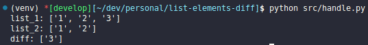

<h1 align="center"> List Elements Diff </h1>

<p align="center">
  

  
  
  <a href="https://github.com/LucasPereiraMiranda/list-elements-diff/commits/main">
    
  </a>

  <a href="https://github.com/LucasPereiraMiranda/list-elements-diff/issues">
    
  </a>

  <a href="https://github.com/LucasPereiraMiranda/list-elements-diff/issues">
    
  </a>
</p>

## 💻 Objectives

Project helper to obtain the different elements between two lists

### Execution preview:

<div align="center">
  
</div>

## 🚀 Techs

The analysis is being performed with the following technologies:

- [Python3](https://www.python.org/)
- [UnitTest](https://docs.python.org/3/library/unittest.html)

## :boom: How to run the application?

- We can activate the virtual environment by running:

```shell
  source /venv/bin/activate # Linux or Mac
```

- After defining the contents of the lists in the `handle` file `list_1` and `list_2`, we can run:

```shell
  python src/handle.py
```

## :heavy_check_mark: How to run project unit tests?

We can run it from the root of the project:

```shell
  python -m unittest discover -s src -v -p "test_*.py"
```

### License

[MIT](https://choosealicense.com/licenses/mit/)
